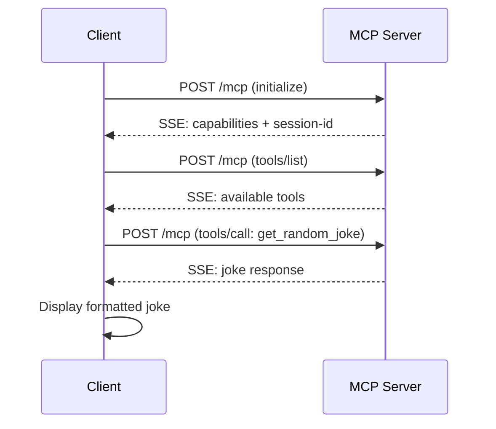

# MCP Joke Client 🎭

A Node.js client that connects to an MCP (Model Context Protocol) joke server to fetch random jokes. This client demonstrates proper MCP protocol implementation including session management, tool discovery, and Server-Sent Events (SSE) handling.

## 🎯 Features

- ✅ **Full MCP Protocol Support** - Implements MCP 2024-11-05 specification
- 🔧 **Session Management** - Proper session ID handling and cookie management  
- 🛠️ **Dynamic Tool Discovery** - Automatically discovers and uses available tools
- 📡 **Server-Sent Events** - Handles SSE responses from MCP servers
- 🎭 **Clean Output** - Beautiful emoji-formatted joke display
- 🔍 **Verbose Mode** - Detailed debugging for development and troubleshooting
- 📖 **Help Documentation** - Built-in usage instructions

## 🚀 Quick Start

### Basic Usage
```bash
node mcp-joke-client.js
```
**Output:**
```
🎭 Why don't eggs tell jokes?
🎆 They'd crack each other up!
```

### Verbose Mode (Debugging)
```bash
node mcp-joke-client.js --verbose
```
Shows detailed MCP protocol communication, session management, and server responses.

### Help
```bash
node mcp-joke-client.js --help
```

## 📋 Requirements

- **Node.js** v16+ (tested with v25.0.0)
- **Internet connection** to reach the MCP server
- **HTTPS support** for secure connections

## 🛠️ Command Line Options

| Option | Short | Description |
|--------|--------|-------------|
| `--verbose` | `-v` | Show detailed debug output including MCP protocol messages |
| `--help` | `-h` | Display usage instructions |

## 🏗️ Technical Architecture

### MCP Protocol Implementation

The client implements the full MCP (Model Context Protocol) 2024-11-05 specification:

1. **Initialization** - Establishes connection with server capabilities exchange
2. **Session Management** - Captures and maintains session IDs via headers
3. **Tool Discovery** - Lists available tools using `tools/list` method
4. **Tool Execution** - Calls joke tools using `tools/call` method
5. **Response Handling** - Processes Server-Sent Events and JSON-RPC responses

### Connection Flow



## 🔧 Server Configuration

**Target Server:** `https://dailyjokemcp.azurewebsites.net/mcp`

### Server Capabilities
- **Protocol Version:** 2024-11-05
- **Tools:** `get_random_joke`
- **Transport:** HTTP with Server-Sent Events
- **Session Management:** Via `mcp-session-id` header
- **Authentication:** Cookie-based session affinity

### Response Format
The server returns jokes in JSON format:
```json
{
  "setup": "Why don't eggs tell jokes?",
  "punchline": "They'd crack each other up!"
}
```

## 🎭 Output Examples

### Default Mode
Clean, emoji-formatted output perfect for end users:
```
🎭 What do you call a fish without eyes?
🎆 A fsh!
```

### Verbose Mode
Detailed debugging information for developers:
```
🎭 MCP Joke Client - Verbose Mode
================================
🎭 Connecting to Joke Server...
🔌 Trying MCP protocol over HTTP...
📡 MCP Response Status: 200
🔍 Response Headers: {
  "content-type": "text/event-stream",
  "mcp-session-id": "d91a24ce0ef54226b6a3278074e2a5d1",
  ...
}
✅ MCP Initialized, capturing session info...
🔑 Session ID: d91a24ce0ef54226b6a3278074e2a5d1
🛠️ Listing available MCP tools...
🛠️ Found tools: get_random_joke
🎯 Will use tool: get_random_joke
🎪 Requesting joke from MCP server...
📡 Joke Response Status: 200
🎭 What do you call a fish without eyes?
🎆 A fsh!
```

## 🔍 Error Handling

The client includes comprehensive error handling:

- **Network Errors** - Graceful fallback with local jokes
- **Protocol Errors** - Detailed error messages in verbose mode  
- **Session Issues** - Automatic session ID capture and retry
- **Timeout Protection** - 10-second request timeouts
- **Malformed Responses** - JSON parsing error recovery

### Fallback Behavior
When the MCP server is unavailable, the client shows a built-in joke:
```
🤡 No joke available from server. Here's one for you:
🎭 Why don't scientists trust atoms?
🎆 Because they make up everything!
```

## 🧪 Development & Testing

### Running Tests
```bash
# Test basic functionality
node mcp-joke-client.js

# Test with verbose output
node mcp-joke-client.js --verbose

# Test help documentation  
node mcp-joke-client.js --help
```

### Debugging

Enable verbose mode to see:
- HTTP request/response headers
- Session ID capture and usage
- MCP protocol message exchange
- Server-Sent Events parsing
- Tool discovery process
- Error handling flow

## 📚 MCP Protocol Details

### JSON-RPC Messages

**Initialize Request:**
```json
{
  "jsonrpc": "2.0",
  "id": 1,
  "method": "initialize",
  "params": {
    "protocolVersion": "2024-11-05",
    "capabilities": { "tools": {} },
    "clientInfo": {
      "name": "simple-joke-client",
      "version": "1.0.0"
    }
  }
}
```

**Tool Call Request:**
```json
{
  "jsonrpc": "2.0",
  "id": 3,
  "method": "tools/call",
  "params": {
    "name": "get_random_joke",
    "arguments": {}
  }
}
```

### Server-Sent Events Format
```
event: message
data: {"jsonrpc":"2.0","id":1,"result":{"setup":"...","punchline":"..."}}
```

## 🔒 Security Considerations

- **HTTPS Only** - All connections use TLS encryption
- **Session Management** - Proper session ID handling prevents session hijacking
- **Timeout Protection** - Request timeouts prevent hanging connections
- **Input Validation** - All server responses are validated before display
- **Error Boundaries** - Comprehensive error handling prevents crashes

## 🚨 Troubleshooting

### Common Issues

**"No joke available from server"**
- Check internet connection
- Verify server is accessible: `https://dailyjokemcp.azurewebsites.net/mcp`
- Try verbose mode for detailed error information

**Network Timeouts**
- Check firewall/proxy settings
- Server may be temporarily unavailable
- Verbose mode shows timeout details

**JSON Parsing Errors**
- Server response format may have changed
- Check verbose output for raw response data
- Verify MCP protocol compliance

### Getting Help

Run with verbose mode for detailed debugging:
```bash
node mcp-joke-client.js --verbose
```

This shows:
- Complete HTTP headers and responses
- MCP protocol message exchange  
- Session management details
- Error stack traces

## 📈 Performance

- **Cold Start:** ~2-3 seconds (includes MCP handshake)
- **Warm Requests:** ~500ms (session cached)
- **Memory Usage:** <50MB
- **Network:** 2-4 HTTP requests per joke

## 🎉 Example Integration

### As a Module
```javascript
const MCPClient = require('./mcp-joke-client');

const client = new MCPClient('https://dailyjokemcp.azurewebsites.net/mcp');
await client.connectAndGetJoke();
```

### In Web Applications
The client can be adapted for browser use with proper CORS handling and fetch API.

## 📝 License

This is a demonstration implementation of the MCP protocol for educational purposes.

## 🙏 Credits

- **MCP Server:** `dailyjokemcp.azurewebsites.net`
- **Protocol:** Model Context Protocol 2024-11-05
- **Runtime:** Node.js v25.0.0

---

**Built with ❤️ for the MCP community** 🎭✨